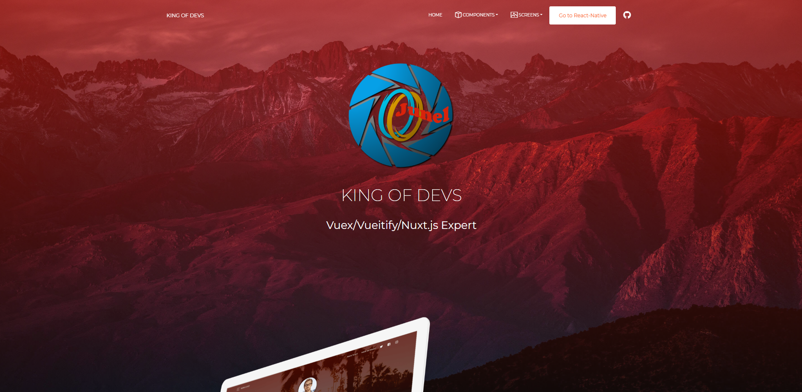
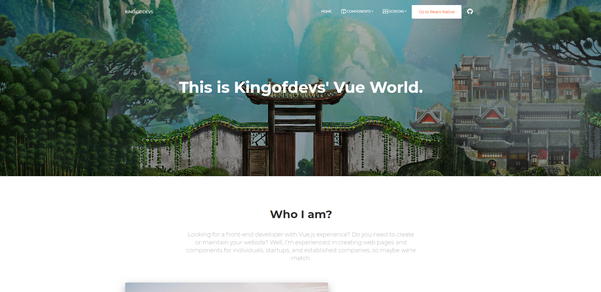

## Vuejs + material ui





Quick start options:

- Clone the repo: `git clone https://github.com/kingofdevs/vue-now-ui-kit.git`.
- Run `npm install` or `yarn install`
- Run `npm run serve` to start a local development server


## File Structure

Within the download you'll find the following directories and files:

```
Vue Now Ui Kit
|-- src
        |-- App.vue
        |-- main.js
        |-- router.js
        |-- assets
        |   |-- fonts
        |   |-- scss
        |-- components
        |-- directives
        |-- layout
        |-- pages
        |-- plugins
```
